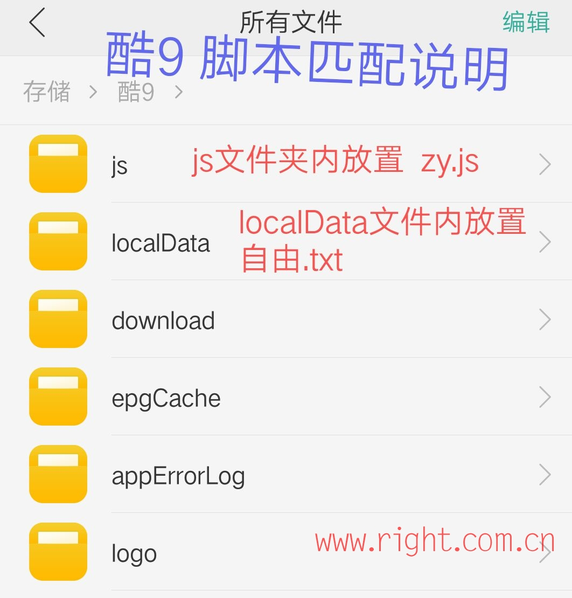

# Television
# 订阅地址(txt格式)
# 可支持订阅该格式软件：
安卓：<a href="https://wfy.lanzout.com/b0izqfjwb" base target="_blank" title="可安装在基于安卓系统的智能电视TV端">酷9播放器</a> (密码:123456) , <a href="https://www.123pan.com/s/PMXuVv-fU74H.html" base target="_blank" title="可安装在基于安卓系统的智能电视TV端">DIYP影音</a> , <a href="https://www.123pan.com/s/PMXuVv-9U74H.html" base target="_blank" title="可安装在基于安卓系统的智能电视TV端">百川影音</a>，<a href="https://down.fongmi.eu.org/#download" base target="_blank" title="该APP有手机版和TV版">OK影视</a>

iOS：<a href="https://apps.apple.com/cn/app/ntplayer/id1613758141?platform=iphone" target="_blank">ntPlayer</a>, <a href="https://apps.apple.com/cn/app/aptv/id1630403500?platform=iphone" target="_blank" title="该APP只能订阅一组订阅链接,订阅多个链接需要付费解锁高级版,其他APP不存在该问题">APTV</a>

所有频道：

<code>https://ghproxy.net/https://raw.githubusercontent.com/Alonso0729/Television/refs/heads/main/txt/EasonTV.txt</code>

备用加速域名:gh-proxy.com,gh.llkk.cc,ghproxy.cn,ghfast.top

# 订阅地址(m3u格式)
# 可支持订阅该格式软件：
安卓：<a href="https://wfy.lanzout.com/b0izqfjwb" base target="_blank" title="可安装在基于安卓系统的智能电视TV端">酷9播放器</a> (密码:123456) , <a href="https://www.videolan.org/vlc/download-android.html" target="_blank">VLC for Android</a> , <a href="https://www.123pan.com/s/PMXuVv-fG74H.html" target="_blank" title="可安装在基于安卓系统的智能电视TV端">TiviMate</a>
 , <a href="https://www.123pan.com/s/PMXuVv-VX74H.html" target="_blank">IPTV Pro</a>

iOS：<a href="https://apps.apple.com/cn/app/ntplayer/id1613758141?platform=iphone" target="_blank">ntPlayer</a> , <a href="https://apps.apple.com/cn/app/am3u/id6443454388?platform=iphone" target="_blank">AM3U</a> , <a href="https://apps.apple.com/cn/app/aptv/id1630403500?platform=iphone" target="_blank" title="该APP只能订阅一组订阅链接,订阅多个链接需要付费解锁高级版,其他APP不存在该问题">APTV</a>

Windows：<a href="https://potplayer.daum.net/" target="_blank">PotPlayer</a> , <a href="https://www.videolan.org/vlc/index.zh_CN.html" target="_blank">VLC Player</a>

所有频道：

<code>https://ghproxy.net/https://raw.githubusercontent.com/Alonso0729/Television/refs/heads/main/m3u/EasonTV.m3u</code>

备用加速域名:gh-proxy.com,gh.llkk.cc,ghproxy.cn,ghfast.top

# 强烈推荐酷9播放器!
该播放器可以直接在本地播放通过js脚本播放频道,效果类似php脚本,但是php需要本地部署,js可直接在本地播放,优势巨大! 
使用方法: 
本仓库js脚本存放位置: https://github.com/Alonso0729/Television/tree/main/ku9/js 

在直播源中调用js脚本举例,格式可参考:

<code>http://A/ku9/js/xjtv.js?id=xjws</code>

如何将js脚本放到本地路径位置: 

劣势:该APP仅支持安卓设备,在Windows和iOS设备上均不可用,js脚本也不会生效 

